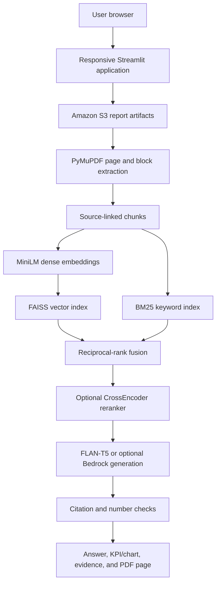

# FinSight RAG

**AI-Powered Financial Document Analysis using Retrieval-Augmented Generation**

M.Tech (Data Science and Artificial Intelligence) project by **Avinaba Ghosh**.

FinSight RAG converts annual reports into searchable financial evidence. A user can upload a PDF, process it into page-aware source blocks, build a hybrid search index, ask questions, inspect cited passages, open the corresponding original PDF page, visualize compatible financial figures, and measure retrieval quality through a labelled evaluation workflow.

Live application: [http://finsight-rag.duckdns.org/](http://finsight-rag.duckdns.org/)

## Project objectives

- Make long annual reports searchable through natural-language questions.
- Keep answers traceable to the original report and physical PDF page.
- Reduce unsupported model output through citation and number checks.
- Present financial values through readable KPI cards, tables, and charts when the evidence is suitable.
- Measure retrieval quality using reproducible benchmark questions.
- Demonstrate a complete cloud and MLOps workflow rather than only a notebook prototype.

## Research foundation

The primary base paper is **“Retrieval-Augmented Generation for Knowledge-Intensive NLP Tasks”** by Patrick Lewis et al., published at NeurIPS 2020. The paper combines learned document retrieval with sequence-to-sequence generation so that a model can use external knowledge instead of relying only on parameters learned during training.

Base paper: [Lewis et al., 2020 — Retrieval-Augmented Generation for Knowledge-Intensive NLP Tasks](https://papers.nips.cc/paper/2020/hash/6b493230205f780e1bc26945df7481e5-Abstract.html)

Supporting research areas include financial question answering and document-grounded reasoning, represented by FinQA, ConvFinQA, DocFinQA, and Self-RAG.

## Difference from the base paper

| Area | Lewis et al. RAG baseline | FinSight RAG |
| --- | --- | --- |
| Primary domain | General knowledge and open-domain question answering | Financial annual reports |
| Knowledge source | Large Wikipedia passage collection | User-selected company and financial-year PDFs |
| Retriever | Dense Passage Retrieval | MiniLM dense retrieval plus BM25 keyword retrieval |
| Result combination | Dense retrieval | Reciprocal-rank fusion with optional CrossEncoder reranking |
| Generator | BART-based RAG models | Local `google/flan-t5-small`, with optional Bedrock Converse when permitted |
| Evidence granularity | Retrieved text passages | Search windows linked to complete parent blocks and physical PDF pages |
| Provenance | Passage-level retrieval | Company, year, source file, page, block coordinates, and PDF fingerprint |
| Verification | Primarily benchmark-based answer evaluation | Citation checks, number checks, source cards, and original-page inspection |
| User experience | Research-model evaluation pipeline | Responsive Streamlit research workspace for upload, retrieval, chat, charts, and evaluation |
| Cloud workflow | Not an application deployment focus | S3, ECR, EC2, Docker, Nginx, DuckDNS, and GitHub Actions CI/CD |
| Evaluation | Standard knowledge-intensive NLP benchmarks | Labelled financial-report questions with Precision@K, Recall@K, MRR, and latency |

The project does not attempt to reproduce the paper’s original Wikipedia-scale DPR/BART training. It adapts the RAG principle to an enterprise-style financial-document workflow and adds provenance, visual inspection, guardrails, evaluation, and automated cloud deployment.

## Implemented contributions beyond the baseline

### 1. Financial-report ingestion and provenance

- Upload annual-report PDFs with company and financial-year metadata.
- Store the original PDF and derived artifacts in Amazon S3.
- Extract page-level layout blocks using PyMuPDF.
- Retain page number, block coordinates, source file, document identity, and PDF SHA-256 fingerprint.
- Reject an original-page preview when the indexed fingerprint does not match replaced PDF bytes.

### 2. Source-linked chunking

- Create compact search windows for retrieval.
- Preserve the complete parent source block for readable evidence.
- Avoid silently truncating source text by character count during answer preparation.
- Flag legacy indexes that do not contain the newer paragraph and coordinate metadata.

### 3. Hybrid retrieval

- Generate normalized 384-dimensional embeddings with `sentence-transformers/all-MiniLM-L6-v2`.
- Store and search vectors using FAISS inner-product similarity.
- Perform BM25 keyword retrieval for exact financial terms and figures.
- Combine semantic and lexical candidates using reciprocal-rank fusion.
- Optionally rerank candidates with a CPU CrossEncoder.
- Clearly identify retrieval scores as ranking signals rather than accuracy or confidence percentages.

### 4. Evidence-grounded assistant

- Ask a manual question or use suggested financial questions.
- Search one selected report independently for every question.
- Generate an answer locally with FLAN-T5 or use configured Bedrock Converse access.
- Require cited page references and check generated numbers against cited evidence.
- Fall back to labelled source excerpts when generation fails or guardrail checks reject a draft.
- Select one evidence page at a time instead of showing multiple long passages together.
- Open and highlight the selected source block on the original PDF page.

### 5. Financial visualization

- Extract explicitly labelled financial amounts from retrieved evidence.
- Normalize supported INR and USD representations while retaining the original display value.
- Display a KPI card for a single reliable figure.
- Display a line chart for compatible financial-year series.
- Display a bar chart for compatible categories or business segments.
- Preserve the source file and PDF page for every plotted value.
- Refuse to create a chart when fewer than two compatible values are available.

### 6. RAG evaluation

- Upload a labelled JSON benchmark containing questions and expected pages.
- Calculate Precision@K, Recall@K, and Mean Reciprocal Rank.
- Measure retrieval latency for each benchmark question.
- Calculate citation validity when answer generation is included.
- Display question-level results and export them as JSON.

### 7. Responsive research interface

- Grouped navigation for overview, document processing, and financial research.
- Responsive layouts for mobile, tablet, and laptop browsers.
- Accessible icons that do not depend on an external icon font.
- Readable evidence paragraphs, preserved lists, and safe HTML escaping.
- Compact source selectors, KPI cards, charts, and evidence tables.

### 8. Production-style delivery

- Automated tests for backend services and Streamlit workflows.
- Docker image containing cached embedding and local generation models.
- Private image storage in Amazon ECR.
- Automated deployment to Amazon EC2 from the `main` branch.
- Nginx reverse proxy and DuckDNS public hostname.
- Container health checking and deployment rollback behavior.

## Current architecture



## AWS and delivery resources

| Resource | Current role in the project |
| --- | --- |
| Amazon S3 | Stores raw PDFs, processed page JSON, chunks, FAISS index files, and index metadata under the configured `S3_BUCKET` and `S3_PREFIX` |
| Amazon ECR | Stores private, commit-addressed Docker images for `financial-intelligence-rag` |
| Amazon EC2 | A `t3.medium` instance runs the application container and self-hosted GitHub Actions deployment runner |
| EC2 instance profile / LabRole | Gives the EC2 workload access to permitted AWS resources without storing short-lived AWS credentials in GitHub |
| GitHub Actions | Runs tests, builds the Docker image, pushes it to ECR, deploys it on EC2, and checks application health |
| Docker | Packages Streamlit, retrieval services, FAISS, MiniLM, FLAN-T5, and required Python dependencies |
| Nginx | Reverse-proxies the Streamlit service from port 8501 to standard HTTP port 80 |
| DuckDNS | Provides the public hostname `finsight-rag.duckdns.org` |

### Services not currently active

- **Amazon Bedrock:** supported by the code when `CHAT_MODEL_ID` and IAM permission are available, but the current AWS Academy/Learner Lab role does not permit the required Bedrock access. The deployed application therefore uses local FLAN-T5.
- **Amazon Textract:** not used in the current implementation. Text and layout blocks are extracted with PyMuPDF.
- **Amazon SageMaker, Google Vertex AI, and Gemini:** appeared in earlier design options but are not part of the current deployed runtime.
- **Amazon CloudWatch application dashboards:** not yet implemented as an application-monitoring feature.

## S3 artifact structure

Each company and year is isolated under the configured prefix:

```text
financial-reports/
└── <company>/
    └── <financial-year>/
        ├── raw/
        │   └── <report>.pdf
        ├── processed/
        │   └── <report>.json
        ├── chunks/
        │   └── <report>_chunks.json
        └── vector-store/
            ├── <report>.faiss
            └── <report>_metadata.json
```

Only reports with completed vector metadata appear in the AI Assistant and RAG Evaluation report selectors.

## Technology stack

| Layer | Technologies |
| --- | --- |
| Interface | Streamlit, responsive CSS, Plotly |
| PDF processing | PyMuPDF, pypdf |
| Embeddings | Sentence Transformers, MiniLM |
| Retrieval | FAISS, BM25, reciprocal-rank fusion, optional CrossEncoder |
| Generation | Local FLAN-T5; optional Amazon Bedrock Converse |
| Data and validation | Python, NumPy, Pandas, Pydantic |
| Cloud storage and runtime | Amazon S3, Amazon ECR, Amazon EC2 |
| Delivery | Docker, GitHub Actions, self-hosted EC2 runner, Nginx, DuckDNS |
| Testing | Pytest, Streamlit AppTest, synthetic PDFs, mocked AWS/model responses |

## Run locally

Use Python 3.11, matching CI. From the repository root:

```bash
python -m venv .venv
```

Windows PowerShell:

```powershell
.\.venv\Scripts\python.exe -m pip install -r requirements.txt
.\.venv\Scripts\python.exe -m streamlit run app.py
```

Linux or macOS:

```bash
.venv/bin/python -m pip install -r requirements.txt
.venv/bin/python -m streamlit run app.py
```

## Configuration

Create a local `.env` file. Do not commit it.

```env
AWS_REGION=us-east-1
S3_BUCKET=<your-report-bucket>
S3_PREFIX=financial-reports
S3_ENABLED=true
LOCAL_CHAT_MODEL_ID=google/flan-t5-small
CHAT_MODEL_ID=
```

| Variable | Purpose |
| --- | --- |
| `AWS_REGION` | AWS region; defaults to `us-east-1` |
| `S3_BUCKET` | Bucket containing report and vector artifacts |
| `S3_PREFIX` | Root key prefix; defaults to `financial-reports` |
| `S3_ENABLED` | Enables S3 upload from the Upload Reports page |
| `LOCAL_CHAT_MODEL_ID` | Local fallback generator; defaults to `google/flan-t5-small` |
| `CHAT_MODEL_ID` | Optional Bedrock model ID; leave empty when Bedrock is unavailable |

Use the normal AWS credentials provider chain locally and the attached EC2 instance role in deployment. Never store AWS keys, session tokens, or DuckDNS tokens in source control.

## Process a report

For every company annual report:

1. Open **Upload Reports**.
2. Provide a stable company name and financial year.
3. Upload and process the original PDF.
4. Open **Chunk Viewer** and generate source-linked chunks.
5. Open **Vector Index** and build the FAISS index.
6. Open **AI Assistant** and select **Refresh reports & indexes**.
7. Select the new report and ask a specific question containing the metric and year.

After schema or chunking changes, reprocess and reindex old reports. A legacy index remains searchable but cannot recover paragraph boundaries or coordinates that were never stored.

## RAG evaluation benchmark

The evaluation page accepts a JSON list:

```json
[
  {
    "question": "What was the reported net profit for FY 2025-26?",
    "expected_pages": [153]
  }
]
```

Expected pages must be manually verified against the original report. Placeholder page numbers produce meaningless zero scores.

Recommended benchmark coverage:

| Case | What to verify |
| --- | --- |
| Reported net profit | Correct company, year, units, scope, exact figure, and page |
| Standalone versus consolidated | The answer does not mix the two accounting bases |
| Business segment | The evidence names the requested segment and metric |
| Prior-year comparison | Both periods are retrieved without invented calculations |
| Table-based figure | Original row, column, unit header, and footnote agree |
| Negative value or percentage | Sign and percentage remain unchanged |
| Missing information | No invented answer; return source-only or insufficient evidence |
| Wrong company or year | No unsupported substitution |
| Replaced PDF | Fingerprint check blocks an old citation against new bytes |
| Scanned page | Warning is shown; no claim that the page was searched |

## Verification

```bash
python -m compileall -q app.py config.py backend pages tests
python -m pytest -q
```

The automated suite uses synthetic PDFs, real FAISS serialization, mocked model/AWS responses, and Streamlit AppTest. It covers:

- Parent-block preservation and chunk metadata.
- Semantic and keyword fusion and deduplication.
- Citation and numeric guardrails.
- Model-failure source fallback.
- PDF fingerprint validation and highlighted source preview.
- Report switching and stable source interactions.
- HTML escaping and readable evidence formatting.
- Financial-value extraction and safe chart selection.
- Retrieval and citation evaluation calculations.
- Responsive navigation and UI integration behavior.

Automated tests do not establish financial answer accuracy. Final acceptance requires manually verified questions from real annual reports.

## Accuracy and performance limitations

- Citation and number checks are conservative guardrails, not semantic entailment verification.
- A number may appear in a cited block but refer to a different metric, unit, scope, or year.
- FLAN-T5-small has limited context length and financial reasoning ability.
- Complex tables and multi-column layouts must be verified against the original PDF page.
- OCR is not implemented; scanned pages may contain no searchable text.
- The assistant currently searches one selected report at a time.
- Cross-company and cross-report comparison are not yet implemented.
- The visualization layer only plots explicitly labelled, compatible evidence values and may correctly return no chart.
- Questions are searched independently; repeat the company, year, and metric in follow-up questions.
- The first local query may be slower while models load; later retrieval requests use cached resources.
- The current public endpoint uses HTTP. HTTPS and authentication remain future hardening work.

## CI/CD and deployment

A push to `main` triggers the existing GitHub Actions workflow:

```text
Push to main
    → Run automated tests
    → Build Docker image
    → Tag image with the commit SHA
    → Push private image to Amazon ECR
    → Self-hosted EC2 runner replaces the application container
    → Run health check
    → Retain rollback capability
```

Feature work should be committed and tested on a branch before being merged into `main`. Updating application code does not rebuild existing S3 report artifacts; reprocessing and reindexing are separate user-controlled operations.

## Future enhancements

- Validated KPI and financial-ratio calculation layer.
- Structured table extraction with row, column, unit, and footnote awareness.
- Multi-report, multi-company, and multi-year comparison.
- OCR support for scanned annual reports.
- Stronger generation and reranking models when infrastructure permits.
- HTTPS, authentication, authorization, and user-level report isolation.
- CloudWatch dashboards, alerting, and retrieval/model observability.
- Model, embedding, index-schema, and dataset version tracking.
- Expanded manually labelled evaluation dataset and regression thresholds in CI.
- Drift monitoring and governed deployment strategies.

## Responsible-use statement

FinSight is a research aid, not verified financial advice. Retrieval scores are not confidence percentages, and generated text must be checked against the cited original report pages before it is used for financial, investment, audit, or compliance decisions.

## References

- Lewis, P. et al. (2020). [Retrieval-Augmented Generation for Knowledge-Intensive NLP Tasks](https://papers.nips.cc/paper/2020/hash/6b493230205f780e1bc26945df7481e5-Abstract.html).
- PyMuPDF. [Text extraction documentation](https://pymupdf.readthedocs.io/en/latest/recipes-text.html).
- Sentence Transformers. [Retrieve and rerank documentation](https://sbert.net/examples/sentence_transformer/applications/retrieve_rerank/README.html).
